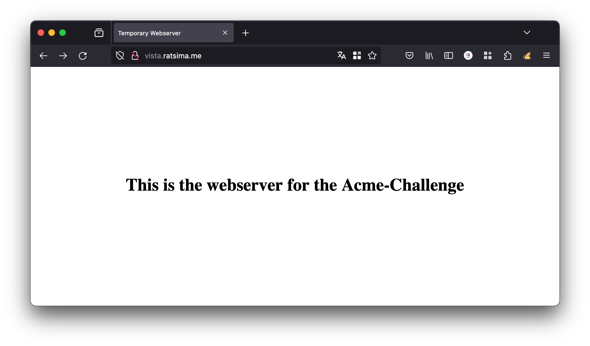
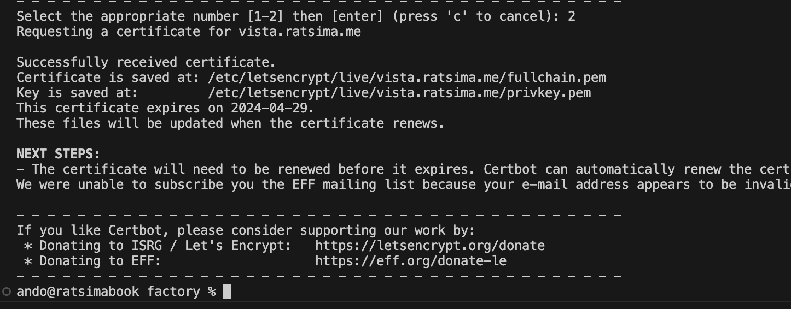
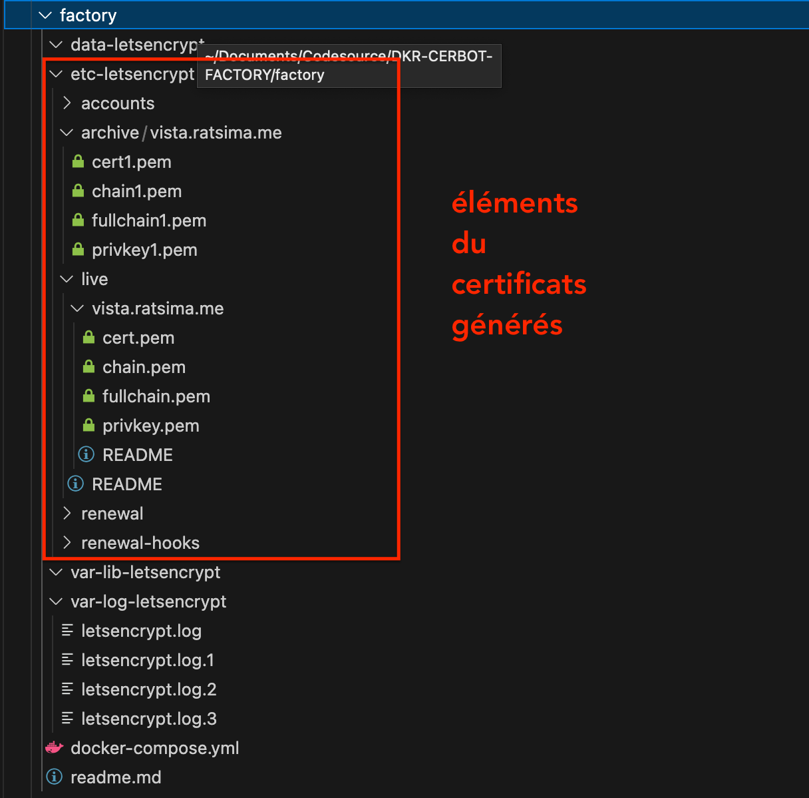
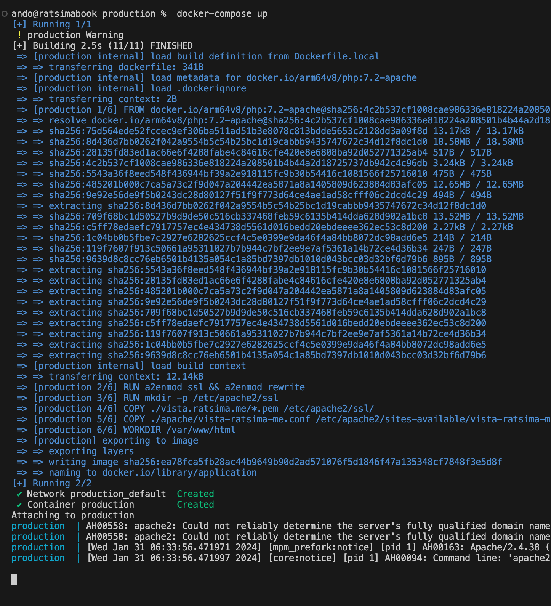

# Instructions

## Préalable

- Naturellement, il faut avoir un sous-domaine qui pointe vers l'IP publique de la machine host

- Dans l'exemple nous testerons avec **vista.ratsima.me** qui pointe sur ma machine 


## Démarrer le site web temporaire

- Ce site temporaire nous sert pour la procédure **Acme Challenge** de Let's encrypt

- Avant de déployer le conteneur **temporary**

    > **Attention** :   
    > Dans le fichier `docker-compose.yml`, utiliser le package apache qui convient à votre environnement.  
    > `arm64v8/php:7.2-apache` est pour MacOS tournant sous processeur ARM
    > ```yml
    >   image: arm64v8/php:7.2-apache
    >   #image: php:7.2-apache
    > ``` 

- Déployer le conteneur **temporary** ; par exemple en ouvrant un terminal dans le répertoire et en exécutant la commande 

    ```bash
    docker-compose up -d
    ``` 

- Tester que le site est bien accessible via **http://vista.ratsima.me**

    > **Attention** : Remplacer `vista.ratsima.me` par le sous-domaine cible

    

## Générer les certificats :

- Déployer le conteneur **factory**, en ouvrant un terminal dans le répertoire, puis en exécutant la commande  la commande suivante

    ```bash
    docker-compose run certbot certonly -d vista.ratsima.me --webroot-path=/data/letsencrypt
    ```
    > **Attention** : Remplacer `vista.ratsima.me` par le sous-domaine cible

- Voici le résultat :

    <!--  -->
    

- Choisir la methode 2

- Accepter les conditions et renseigner le mail de l'admin


- Voici la fin des logs

    <!--  -->
    

## Localisation des certificats générés

- *Cerbot* aura écrit les éléments du certificat dans le dossier `factory/etc-letsencrypt`
    


- A ce stade le site web temporaire n'est plus utile ; arrêter le conteneur.

## Transfert des éléments du certificat vers l'appli de production

- Copier le dossier `factory/etc-letsencrypt/live/vista.ratsima.me/` vers `production/vista.ratsima.me/`

- Copier le dossier `factory/etc-letsencrypt/archive/vista.ratsima.me/` vers `production/archive/`

## Démarrer l'appli de production

- Le serveur de production contient une appli web standard tournant sur PHP 7.2

- Le fichier `Dockerfile.local` contient les instructions

    > **Attention** :   
    > Dans le fichier `Dockerfile.local`, utiliser le package PHP qui convient à votre environnement. `arm64v8/php:7.2-apache` est pour MacOS tournant sous processeur ARM
    > ```bash
    > #FROM php:7.2-apache
    > FROM arm64v8/php:7.2-apache
    >``` 

- Démarrer le conteneur ; ci-dessous le log

    

- Tester l'instance

    